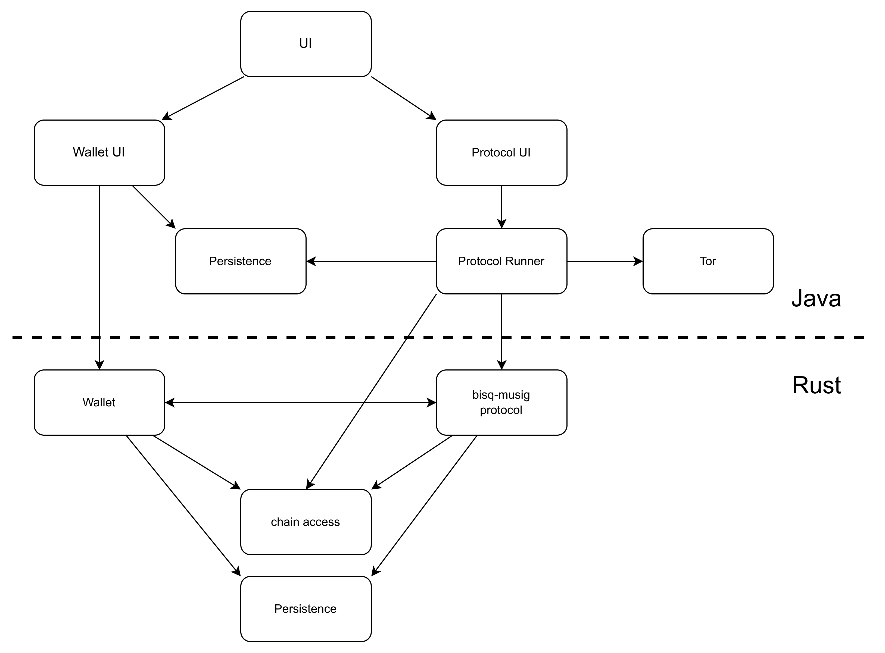

# bisq MuSig2 Protocol

This is module inside Bisq2. it implements a new Multisig protocol for Bisq2, this protocol is similar to the protocol used in Bisq1.
It enables to buy/sell bitcoin from other peers without needing any trust in the other peer or into any coordinator or any third party. Since there is no intermediary to
conduct the exchange, this is as close as its gets to the original bitcoin idea of conducting transaction in a p2p manner secured just by cryptography.
Main changes to the Bisq1 protocol are:

- more private, looks like a normal transaction without script.
- fewer fees, happy path uses only one transaction
- uses taproot
- instead of scripts it uses advance cryptographic schemes like MuSig2 and Adaptor-signatures.
- protocol is designed to handle unresponsive traders automatically

## overview

This project is the handling the cryptographic part of the overall protocol. Even though it is the centerpiece there are more pieces necessary to pull this off.
Here is an Overview drawing:

## docs

To get a more indepth understanding of what this module is doing, please read [SingleTxOverview](./concept/SingleTxOverview.md)
This module's programming language is Rust.
Technologies include:

- bitcoin taproot transactions
- scriptless scripts (MuSig2, adaptor signatures)
- Rust
- gRPC
- Compact Block Filters (CBF)
- Bitcoin Development Kit (BDK), especially bdk-wallet
- crate tokio

If you have any knowledge in one of these areas, you please consider contributing to this project.

## contribution

You can contact us at [matrix](https://matrix.to/#/#bisq-muSig-dev:matrix.org).
If you want to get a feeling about this project, check it out and start the testcase
`tests::test_musig`. However, running this needs a working installation of [nigiri](https://nigiri.vulpem.com/)
, please see this section [Running Integration Tests](./adaptor/README.md).
Accepted contributions are eligible for compensation, so you could earn money for your work.

