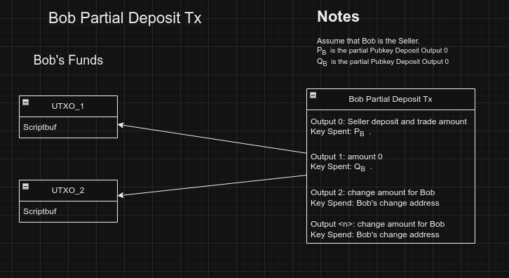

Bob creates a transaction with Output 0 as above, then lets the wallet add out the inputs and change output. Then he
sends this PSBT to Alice. Bob adds his 2 MuSig2 Pubkey ($P_B$ and $Q_B$) to the PSBT. (check with rust-bitcoin is PSBT
has Musig fields).

Alice imports the PSBT to her partial Deposit Tx.

1. Copy all Inputs from Bob, check that the scriptbuf of Bob's input are not inside Alice wallet.
2. Extract $P_B$ and $Q_B$ from the PSBT, for initialising the MuSig2 process.
3. Copy the change Output, do not copy Output 0 nor the amount of Output 0.

Alice builds the Output 0 with amount Seller deposit and trade amount. Key Spent is the Key
Aggregation   $P=keyAgg(P_A,P_B)$
Alice builds the Output 1 with amount buyer deposit, key spend is the key aggregation $Q=keyAgg(Q_A,Q_B)$

Alice signs the Tx and sends the PSBT to Bob.

With Bob's signed PSBT copy the signature from Bob inputs (remember which inputs where Bobs!!!) to Alice PSBT. Make sure
Bob has provided signature for all his inputs. Do not sign after importing Bob signatures.

Check if the resulting Tx is valid (input and out amounts??)

broadcast the transaction (maybe check if other hasn't broadcast yet)
